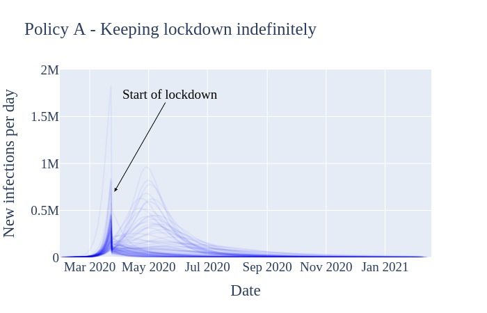
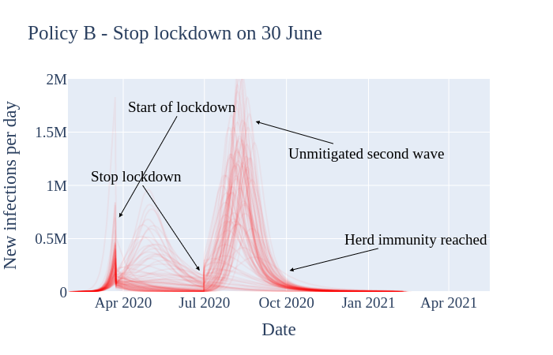
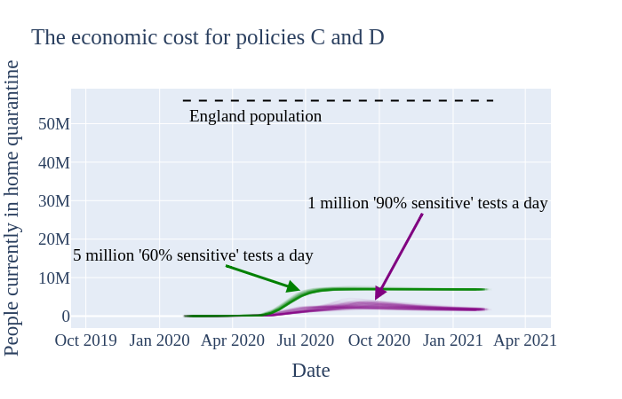

# COEXIST

## UNDER DEVELOPMENT

This is a high performance implementation of [https://github.com/gbohner/coexist](https://github.com/gbohner/coexist).

SEIR model
- [x] basic model
- [] isolation
- [] testing
Compartmental
- [] proof of concept
Inference
- [] BayesOPT
- [] particle mcmc

### Summary of results from python model  
This section compares four potential (exit strategy) policies across 91 different estimates of the current pandemic burden. Each estimate of current burden is represented by a single curve in each of the figures below.

We first produce the expected result: stopping the lockdown entirely without a clear treatment for or vaccine against COVID-19 results in a massive second wave (Policy B, below). Most of the population becomes infected, eventually resulting in some form of herd immunity, likely at the cost of many more lives than other exit strategies.

Deploying reliable virus testing at the rate of 1 million tests per day, combined with a policy of 14 day home quarantine for positive test cases, has the expected flattening effect on the new infections curve (Policy C, below). However, ~60% of the total population still becomes infected relatively quickly, again yielding herd immunity.  The main advantage of this testing strategy is to mitigate the pressure on health services.

Note that the results in Policy C assume that the 1 million 'reliable' daily tests are deployed with a practical -- not theoretical! -- sensitivity of 90% around symptom onset (when patients present the highest viral loads), decreasing to 85% for later stages. Test sensitivity is assumed to be 70% for asymptomatic carriers. Such a test is likely better than is realistically achievable.

For comparison, we investigated the effect of instituting the same case-isolation home quarantine policy with a dramatically less sensitive virus test, but deployed at the level of 5 million tests per day (Policy D, below).  We find that this test, despite being so insensitive as to perhaps appear 'useless,' is capable of not only flattening the curve, but effectively suppressing it.  This prevents a large portion of the population from contracting the disease at all. This supression buys time to develop vaccines and vaccination-based immunity, whilst going about normal levels of social mixing (for those not home quarantined).

The results in Policy D assume that 5 million 'useless' daily tests are deployed having only 60% maximum sensitivity around symptom onset, reducing to 50% for later stages of the disease, and 20% for asymptomatic carriers.

One drawback of employing the 'larger number but lower reliability' testing strategy is economic cost.  We assume a false positive rate of 5% for both tests (likely higher than is realistic!); deploying more tests then causes a higher absolute number of healthy but quarantined false positives. The unnecessary transient quarantining of approximately an extra 3 million people (~2% of England's population) is arguably justified in the context of the proposed health benefits of suppressing viral transmission, as well as the economic benefits of ending the current lockdown.

*The above figures were generated on 22 April 2020, using a full model fit that took place 21 April 2020, which incorporated hospitalisation, testing and mortality data up to and including 14 April 2020. At the time of fitting, more recent data was excluded due to its incompleteness.*
